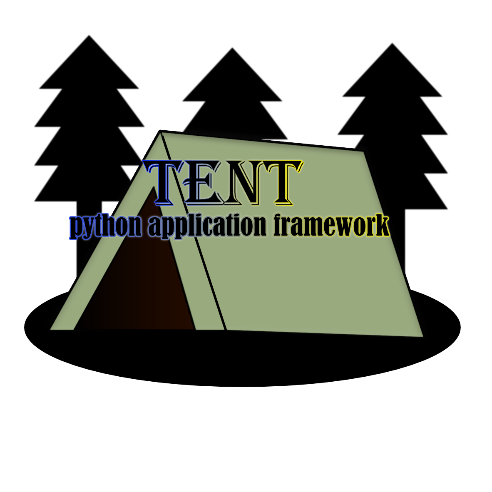

# Tent Python Application Framework

> developed and made by [@EliaOndacs](https://github.com/EliaOndacs)

## **Overview**

Tent is a Python application framework designed to be lightweight, simple and customizable as possible.

## License

[License](LICENSE)

## Contributing

any contribution to this project will be appreciated
i try to look at all the merge requests and PR's and try to response to everyone
but please only submit your merge request if you already tested your code changes and there is no bug
